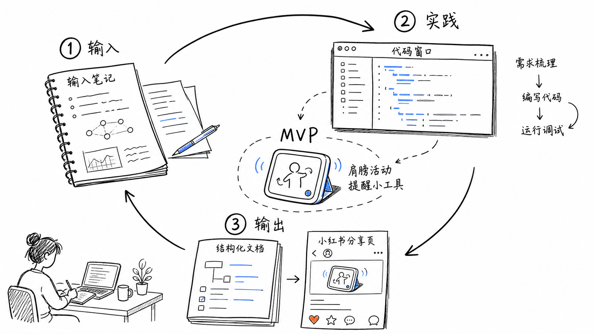
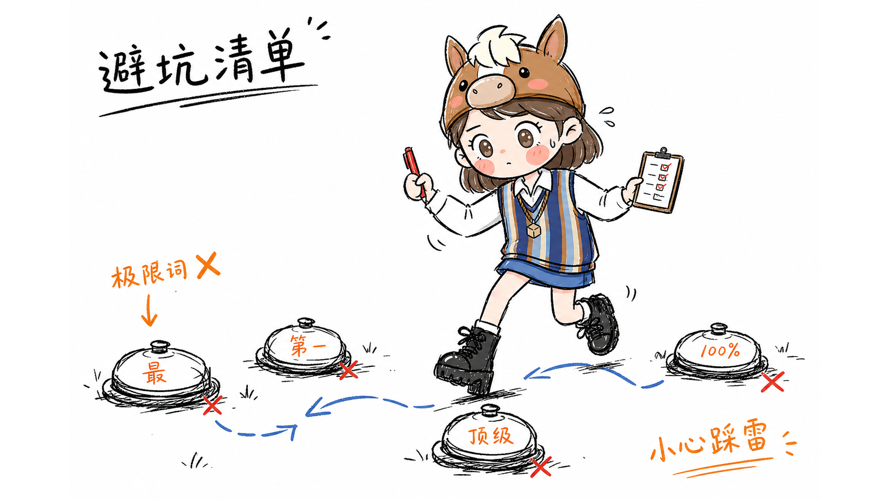
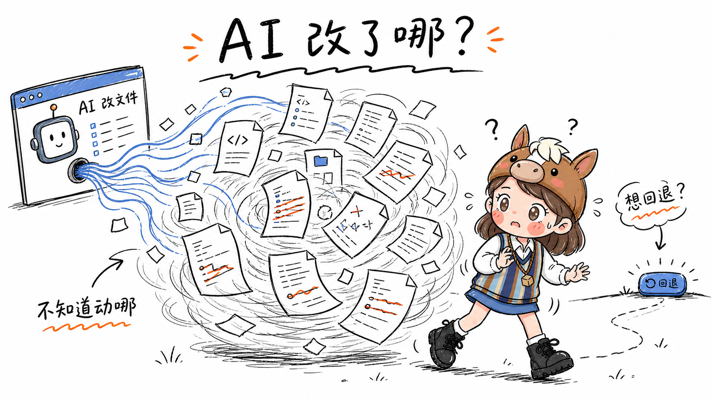
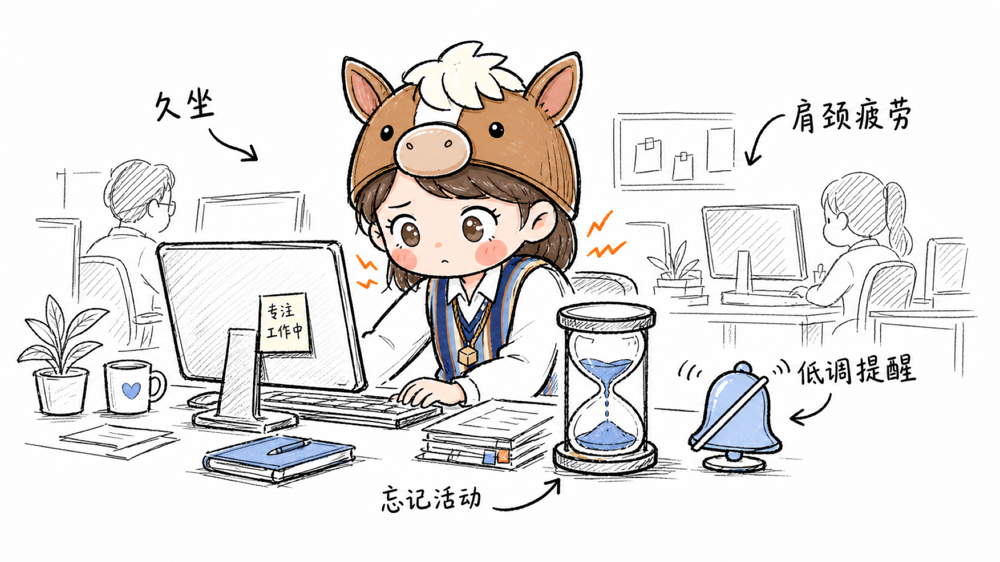
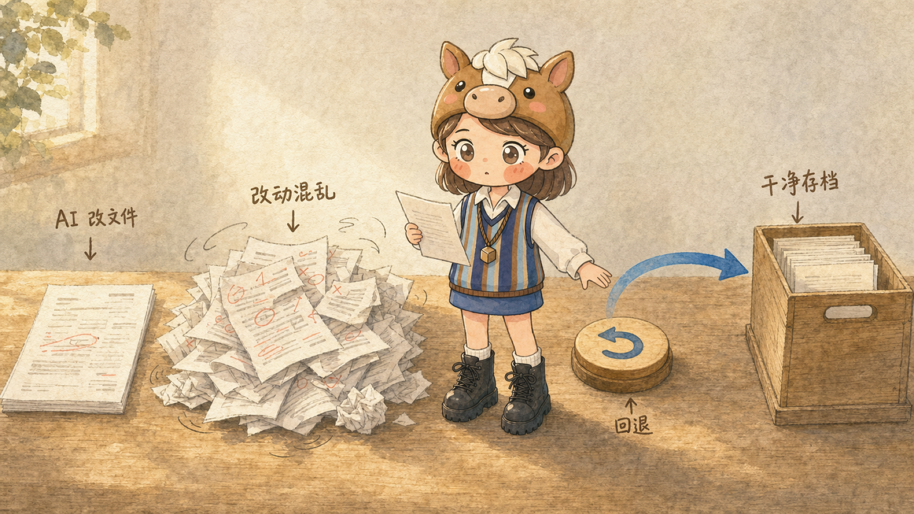
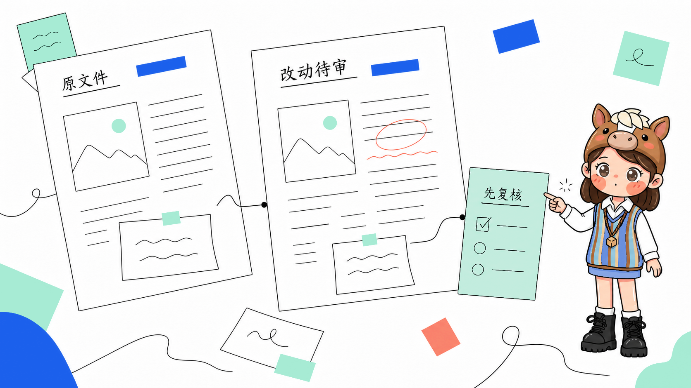
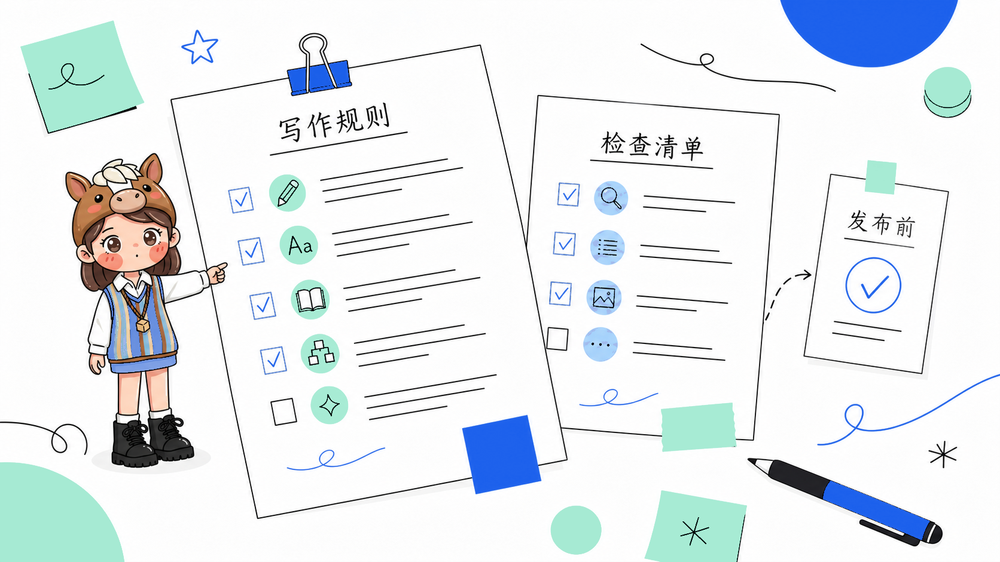

# gimi-illustration · 文章 / 口播配图

> 输入正文，输出可读、有梗、不说明书的配图。  
> 开源 AI Agent Skill · [MIT](LICENSE) · Gimi 形象见 [IP-NOTICE.md](IP-NOTICE.md)

专门给中文内容做配图：把文里的判断、流程、对比、状态、隐喻，画成清爽、能一眼读懂的图。

适合长文、小红书图文、博客、Notion、口播脚本、工作流和方法论说明。

---

## 和「只会出图」不一样

**1. 三种风格，同一件事也能换气质**  
默认怪诞手绘；也可以说「暖调绘本」「产品方案」。不是滤镜按钮，而是不同使用场景的画法——知识表达、叙事手帐、职场方案，各有一套。

**2. 自定义 IP**  
传一张角色正视图，说「录入 IP」。确认形象后，后续配图尽量按这个人设走，不用每张重描述长什么样。想配几个角色就录几个。

**3. IP 可插拔**  
默认用 Gimi（马帽女孩）当讲解员；不想要角色，直接说「不要 IP / 无角色」。有角色时，角色要参与把事讲清楚，不是角落摆件。

**4. 尺寸 & 标题可调**  
默认横版 16:9；小红书竖版说「竖版」即可。需要图内标题就说「加标题：xxx」，不要标题就不加。

---

## 三种风格长什么样

同一类内容，三种画法。用自然语言选风格即可，不必记 id。

> 预览图用仓库相对路径，本地打开 README 就能看。发布并打 `v3.0` tag 后，也可用 jsDelivr：`https://cdn.jsdelivr.net/gh/GiMi-Xiaomi/gimi-illustration-skill@v3.0/` + 下方同路径。

### 怪诞手绘（默认）

白底线稿，软蓝点睛，像编辑部手绘涂鸦。适合知识表达、个人特色、有点梗的方法论。

你可以这样说：`怪诞手绘` / `线稿涂鸦`

**实践闭环（无角色）**



**写作避坑（Gimi IP）**



**AI 改文件（Gimi IP）**



**久坐肩颈（Gimi IP）**



### 暖调绘本

温暖丰润的水彩手绘，纸纹、淡晕和日光。适合旅行、手帐、叙事、想留一点温度的内容。

你可以这样说：`暖调绘本` / `旅行手帐风`

**交付主线（无角色）**


**实践闭环（无角色）**


**久坐肩颈（Gimi IP）**


**AI 改文件（Gimi IP）**



### 产品方案

扁平编辑插画，把方案、取舍和路径画成可读的共创现场。适合职场方案、决策说明、对内对外讲清楚「为什么这样做」。

你可以这样说：`产品方案` / `方案图`

**可分享结果（无角色）**


**交付主线（无角色）**


**AI 改文件（Gimi IP）**



**写作避坑（Gimi IP）**



没指定风格时，默认用怪诞手绘。

---

## 支持的角色

**默认：Gimi**  
马帽女孩，适合创作、方法论、职场、产品讲解类内容。

**自定义：你的形象**  
上传正视图 → 录入 → 之后用你的角色配图。

**无 IP**  
只要结构和隐喻、不要吉祥物，说一声就能关。

---

## 怎么用

日常配图：发「配图」+ 粘贴正文（或文章链接），需要时补一句风格、IP、尺寸或标题。

```
配图
用暖调绘本，不要角色，竖版

[粘贴你的文章正文]
```

录入角色：发「录入 IP」+ 附正视图。

改法随便说：`竖版` / `不要角色` / `换成产品方案` / `只要 3 张` / `这张太满了重画`。

**触发词：** `配图` / `给文章配图` / `帮我配图` / `illustration`  
**录入：** `自定义 IP` / `录入 IP` / `上传形象` / `新建 IP`

---

## 安装

**Codex（推荐）**

```bash
git clone https://github.com/GiMi-Xiaomi/gimi-illustration-skill.git
cd gimi-illustration-skill
mkdir -p "${CODEX_HOME:-$HOME/.codex}/skills"
cp -R . "${CODEX_HOME:-$HOME/.codex}/skills/gimi-illustration"
```

**Cursor**

```bash
mkdir -p ~/.cursor/skills
ln -s "$(pwd)" ~/.cursor/skills/gimi-illustration
```

装好后，在对话里直接发「配图」+ 正文就行。生图由当前平台的内置工具完成（Codex 的 Image Gen / Cursor 的 GenerateImage）。

---

## 小提示

- 正文越完整，图越准；只丢标题容易虚
- 一批几张够用就好，别把文章做成绘本
- 不满意直接说哪里不对，优先重画该张
- 同一段内容想换气质，直接说换风格，不用重写需求

输出会落在 `outputs/`，并附带 `shot-config.md`（配图策略，方便回溯）。

---

## 目录说明

| 路径 | 作用 |
|------|------|
| `SKILL.md` | Skill 主入口与工作流 |
| `references/styles/` | 三套风格定义（怪诞手绘 / 暖调绘本 / 产品方案） |
| `references/ip/_template.md` | 自定义 IP 合约 + 录入流程（Step 0） |
| `references/` | 构图、视觉承诺、prompt、QA、IP 协议 |
| `assets/ip/gimi/` | Gimi 设定图与三风格校准案例 |
| `assets/none/examples/` | 无角色模式三风格正向案例 |

---

## License

- Skill 代码与文档结构：[MIT License](LICENSE)
- Gimi 角色形象（马帽女孩）：见 [IP-NOTICE.md](IP-NOTICE.md)，不在 MIT 授权范围内

## 关于作者

**Gimi（米未可）** — UX 设计师 / AI Builder  
用 Skill + Vibe Coding 做工作提效与内容配图。

小红书：[米未可](https://www.xiaohongshu.com/user/profile/593a3b5033594a18f9aea21f)
